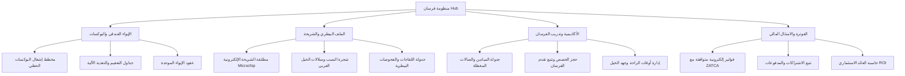

# 🐎 فرسان | FursanHub — أرشيف المرحلة الأولى (Phase 1 Pretotype)

<div align="center">


<br />

**المنظومة السحابية الذكية لإدارة وحوكمة المرابط، اسطبلات الخيل العربية الأصيلة، ومراكز الفروسية**

[نبذة عن المشروع](#-عن-المشروع) • [أهداف المرحلة الأولى](#-أهداف-النموذج-الأولي-pretotype) • [المميزات والركائز](#-المميزات-والركائز-الأساسية) • [البنية التقنية](#-البنية-التقنية-tech-stack) • [هيكل المشروع](#-هيكل-المشروع) • [التشغيل المحلي](#-التشغيل-المحلي) • [حالة الأرشيف والملكية](#-حالة-الأرشيف-وحقوق-الملكية)

</div>

---

## 📌 عن المشروع

يُعد هذا المستودع **أرشيفاً تقنياً مغلق المصدر (Closed-Source Archive)** للمرحلة الأولى (**Phase 1 Pretotype**) من منصة **«فرسان» (FursanHub)**.

منصة «فرسان» هي منظومة برمجية سحابية موحدة (SaaS) صُممت خصيصاً لتلبية المتطلبات التشغيلية والفندقية والطبية لملاك ومربي الخيل، المرابط الفاخرة، وأكاديميات الفروسية في المملكة العربية السعودية والخليج العربي، بما يجمع بين الحفاظ على أصالة الموروث وأعلى معايير الحوكمة والتحول الرقمي.

> [!NOTE]
> هذا المستودع يوثق النسخة المكتملة من النموذج الأولي المتقدم (High-Fidelity Interactive Pretotype)، والذي تم بناؤه لاختبار واجهات المستخدم، ومحاكاة دورات العمل التشغيلية المعقدة، والتحقق الميداني من جاهزية المنتج قبل إطلاق البنية التحتية السحابية الموسعة للمرحلة الثانية.

---

## 🎯 أهداف النموذج الأولي (Pretotype - Phase 1)

تم تطوير هذه المرحلة لتحقيق مجموعة من الأهداف الاستراتيجية:

1. **التحقق من ملاءمة المنتج للسوق (Product-Market Fit Validation):** عرض ومحاكاة أدوات المنصة أمام كبار الملاك ومديري المرابط لاستقراء التغذية الراجعة الدقيقة.
2. **هندسة تجربة مستخدم فاخرة (Luxury Equestrian UX):** تصميم واجهات تفاعلية تدعم اللغة العربية بالكامل (RTL-First)، وتواكب الهوية التراثية الأصيلة مع طابع تقني معاصر.
3. **محاكاة العمليات التشغيلية الحرجة:** نمذجة إدارة البوكسات، السجلات البيطرية، جدولة الميادين، والفوترة الإلكترونية قبل الربط النهائي مع خوادم الإنتاج.

---

## ✨ المميزات والركائز الأساسية (Phase 1 Scope)

تضم المنصة أربع ركائز تشغيلية متكاملة تم تطويرها ومحاكاتها تفاعلياً:



### 1. 🏨 إدارة الإيواء الفندقي والبوكسات (Stables & Box Management)
- متابعة لحظية لحالات الغرف (مشغول، شاغر، عزل صحي، قيد التعقيم).
- مراقبة مؤشرات البيئة الداخلية للبوكس (درجات الحرارة، أجهزة التغذية الذكية، تنبيهات المياه).
- إدارة عقود الإيواء الموحدة وحفظ بيانات الملاك وسجلات الدخول والخروج.

### 2. 🧬 الجواز الصحي الرقمي وشجرة النسب (Pedigree & Digital Passport)
- مطابقة فورية لأرقام **الشرائح الإلكترونية المعتمدة (RFID Microchips)**.
- توثيق شجرة النسب وسلالات الخيل العربية الأصيلة (صقلاوي، كحيلان، عبيان، هدبان، دهمان).
- سجل بيطري شامل يتضمن تاريخ اللقاحات، الفحوصات المخبرية الدورية، ومواعيد حذوة الحوافر.

### 3. 🏇 أكاديمية الفروسية وحجز الميادين (Academy & Arena Scheduling)
- تقويم تفاعلي مدعوم بـ FullCalendar لمنع التضارب في استخدام صالات التدريب وميادين القفز والدريساج.
- متابعة بطاقات أداء الفرسان وتقييم تطورهم الفني والبدني.
- ضبط الحِمل التدريبي الأسبوعي لكل حصان لضمان أعلى مستويات الرعاية والسلامة.

### 4. 🧾 الفوترة والامتثال المالي (Billing & ZATCA Compliance)
- نماذج فواتير ضريبية مبسطة تدعم متطلبات هيئة الزكاة والضريبة والجمارك (ZATCA Phase 2 Readiness) مع ترميز QR Code.
- دعم قنوات الدفع المتعددة (مدى، Apple Pay، والتحويلات البنكية المباشرة).
- تقارير تفصيلية لمصروفات وإيرادات كل رأس خيل وفرع مربط.

### 5. 🎮 المحاكي التفاعلي الحي (Interactive App Simulator)
- واجهة عرض حية في الصفحة الرئيسية تتيح للعملاء تجربة المنظومة عبر 4 غرف عمليات افتراضية قبل الاشتراك الفعلي.
- حاسبة تفاعلية لتقدير العائد الاستثماري (ROI Calculator) وتوفير الهدر المالي للمرابط.

---

## 💻 البنية التقنية (Tech Stack)

تم بناء الواجهة الأمامية بالاعتماد على أحدث التقنيات لضمان أعلى درجات الأداء والاستقرار:

| المجال | التقنية المستخدمة | الوصف |
| :--- | :--- | :--- |
| **إطار العمل** | [Next.js 16 (App Router)](https://nextjs.org/) | إطار العمل الرئيسي للواجهات وتهيئة الخادم |
| **المكتبة الأساسية** | [React 19](https://react.dev/) | بناء المكونات التفاعلية وإدارة الحالة |
| **لغة البرمجة** | [TypeScript 5.7](https://www.typescriptlang.org/) | توفير الأمان النوعي للبيانات والكود البرمجي |
| **التنسيق والأنماط** | [Tailwind CSS 3.4](https://tailwindcss.com/) | تصميم واجهات حديثة ومرنة ومتوافقة مع مختلف الشاشات |
| **مكونات الواجهة (UI)** | [Radix UI Primitives](https://www.radix-ui.com/) | مكونات تفاعلية قياسية ومهيأة لمعايير سهولة الوصول |
| **الأيقونات** | [Lucide React](https://lucide.dev/) | مكتبة أيقونات متناسقة وخفيفة الحجم |
| **التقويم والجدولة** | [FullCalendar 6.1](https://fullcalendar.io/) | عرض وإدارة مواعيد الميادين والتدريبات |
| **دعم المظهر** | [Next Themes](https://github.com/pacocoursey/next-themes) | دعم كامل للوضع الليلي (Dark Mode) والنهاري (Light Mode) |

---

## 📂 هيكل المشروع (Project Structure)

```text
pretotype/
├── src/
│   ├── app/                      # مسارات ومخططات Next.js App Router
│   │   ├── calender/             # شاشة جدول ومواعيد الميادين والتدريب
│   │   ├── dashboard/            # لوحة القيادة والمؤشرات التنفيذية الرئيسية
│   │   ├── data/                 # إدارة البيانات والسجلات
│   │   ├── finance/              # الحسابات، الإيرادات، والفواتير الضريبية
│   │   ├── horses/               # إدارة الخيول، البطاقات التعريفية، وشجرة النسب
│   │   │   └── profile/          # الملف البيطري والتشغيلي المفصل للخيل
│   │   ├── login/ & signup/      # واجهات تسجيل الدخول وإنشاء الحساب
│   │   ├── media/                # مكتبة الصور، الوثائق، والوسائط
│   │   ├── programs/             # البرامج التدريبية للأكاديمية والفرسان
│   │   ├── stables/              # إدارة مرافق المربط والبوكسات الفندقية
│   │   ├── team/                 # إدارة الكادر الوظيفي (مدربين، أطباء، سايسين)
│   │   ├── layout.tsx            # التخطيط العام، الخطوط، وتضمين موفري الخدمات
│   │   └── page.tsx              # الصفحة الرئيسية التعريفية والعرض التفاعلي الحي
│   ├── components/               # المكونات البرمجية القابلة لإعادة الاستخدام
│   │   ├── demo/                 # مكونات العرض التفاعلي الحي والمحاكي والحاسبة
│   │   ├── calender/             # مكونات تكامل FullCalendar
│   │   ├── table/                # جداول البيانات المتقدمة
│   │   ├── ui/                   # عناصر التصميم الأساسية (Buttons, Dialogs, Cards...)
│   │   ├── Header.tsx            # شريط التنقل العلوي
│   │   ├── sidebar.tsx           # القائمة الجانبية للوحة التحكم
│   │   └── ThemeProvider.tsx     # موفر سمات الألوان والمظهر
│   └── lib/                      # الأدوات المساعدة ودوال التنسيق
├── public/                       # الأصول والوسائط الثابتة (الصور والشعارات)
├── tailwind.config.ts            # إعدادات أنماط وتخصيصات الألوان الفاخرة
├── next.config.js                # إعدادات بيئة عمل Next.js
├── tsconfig.json                 # إعدادات مترجم TypeScript
└── package.json                  # الاعتماديات وحزم المشروع
```

---

## 🚀 التشغيل المحلي (Local Development)

> [!TIP]
> يتطلب المشروع تثبيت بيئة **Node.js (الإصدار 18.18 أو أحدث)** ومدير الحزم `npm` أو `pnpm`.

### 1. استنساخ المستودع
```bash
git clone https://github.com/osos3lom/pretotype.git
cd pretotype
```

### 2. تثبيت الاعتماديات
```bash
npm install
```

### 3. تشغيل خادم التطوير المحلي
```bash
npm run dev
```

افتح المتصفح وانتقل إلى الرابط التالي لاستعراض المنظومة:
```text
http://localhost:3000
```

### 4. بناء المشروع للإنتاج (Production Build)
```bash
npm run build
npm run start
```

---

## 🔒 حالة الأرشيف وحقوق الملكية (Archive & Proprietary Notice)

- **حالة المستودع:** هذا المشروع يمثل **أرشيفاً مكتملاً للمرحلة الأولى (Phase 1 Frozen Archive)**، ولن يستقبل أي تعديلات تشغيلية جديدة عبر هذا المستودع.
- **الانتقال للمرحلة الثانية (Phase 2):** تم نقل عمليات التطوير للإنتاج الفعلي والربط السحابي (Enterprise Backend & Database Integration) إلى مستودعات المرحلة الثانية الخاصة.
- **حقوق الملكية الفكرية:** جميع الحقوق والتصاميم والشفرات البرمجية محفوظة لمنظومة **فرسان (FursanHub)**. يُحظر نسخ، توزيع، أو إعادة استخدام أي جزء من هذا المشروع دون تصريح خطي مسبق.

---

<div align="center">
  <sub>صُنعت بعناية لخدمة أصالة الخيل العربي ومستقبل الفروسية الرقمي 🇸🇦 🐎</sub>
</div>
